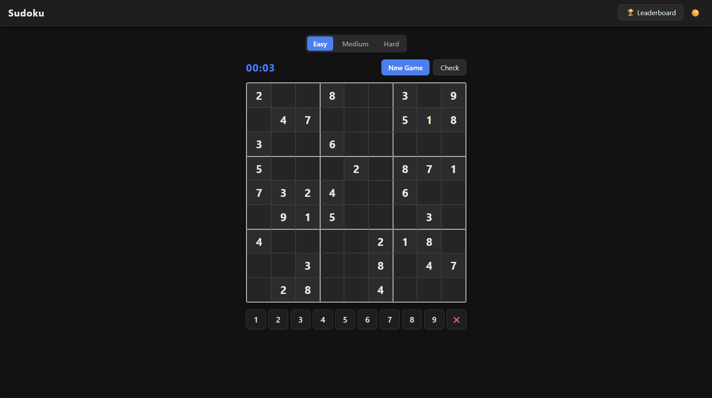

# Sudoku

A web-based Sudoku game with a persistent leaderboard, served from a containerised Node.js backend.



## Features

- Three difficulty levels — Easy, Medium, Hard
- Server-side puzzle generation (backtracking algorithm, unique solutions guaranteed)
- Persistent game sessions — close the tab and resume where you left off (sessions expire after 24 hours)
- Per-difficulty leaderboard — top 10 scores, all entries shown
- Server-side validation — the solution never leaves the server
- Conflict highlighting & live timer
- Dark mode — follows system preference, with a manual toggle

## Running locally

### With Docker Compose (recommended)

```bash
docker compose up --build
```

Then open <http://localhost:3000>.

The SQLite database is stored in the `sudoku-data` named volume and survives container restarts.

### Without Docker

```bash
cd backend
npm install
node server.js
```

Then open <http://localhost:3000>.

## Container image

The image is published to the GitHub Container Registry on every push to `main`:

```bash
docker pull ghcr.io/JakePeralta7/sudoku:latest
docker run -p 3000:3000 -v sudoku-data:/data ghcr.io/JakePeralta7/sudoku:latest
```

## API

| Method | Path | Description |
|--------|------|-------------|
| `POST` | `/api/puzzle` | Generate a new puzzle. Body: `{ difficulty: "easy" \| "medium" \| "hard" }` |
| `GET`  | `/api/puzzle/:sessionId` | Resume a persisted session. |
| `POST` | `/api/validate` | Validate a completed board. Body: `{ session_id, board }` |
| `GET`  | `/api/leaderboard?difficulty=` | Top 10 scores for a difficulty. |
| `POST` | `/api/leaderboard` | Submit a score. Body: `{ player_name, time_seconds, difficulty, session_id }` |

## Project structure

```
.
├── backend/
│   ├── db.js          # SQLite schema, sessions & scores
│   ├── puzzle.js      # Backtracking puzzle generator
│   ├── server.js      # Express app & API routes
│   └── package.json
├── frontend/
│   ├── index.html
│   ├── style.css      # CSS custom properties + dark mode
│   └── game.js        # Game logic, timer, leaderboard UI
├── .github/
│   └── workflows/
│       └── docker-publish.yml
├── docker-compose.yml
└── Dockerfile
```

